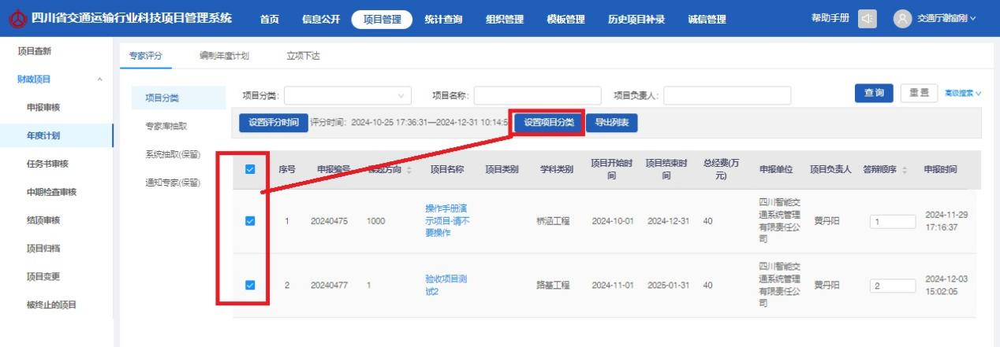

# 厅科信处操作指南V1.1(1)

**厅科信处操作指南**

### 系统登录

互联网访问地址：[https://182.150.21.199:4431/](https://182.150.21.199:4431/)

### 登录方式

1. 通过账号密码方式登录

.png>)

1. 通过手机短信方式登录

输入个人手机号，点&#x51FB;**“发送”**，输入收到的短信验证码，即可登录。

.png>)

### 更改密码

选择系统管理模块，点击左&#x4FA7;**“密码修改”**&#x83DC;单，可设置单位账号新密码。

.png>)

### 首页

首页即为登录系统后所展示的页面，页面主要展示分为“待处理事务”、“公示公开”、“快捷入口”等模块。

.png>)

### 待处理事务

待待处理事务显示当前用户待处理的事务信息，分为财政项目待办事项和自筹项目待办事项，可针对不同节点的待办事项点击快速跳转至对应节点处理。

.png>)

财政项目待办事项主要展示“将逾期未提交任务书的项目”、“将逾期未提交验收申请的项目”、“已超期未提交任务书的项目”、“已超期未提交验收申请的项目”、“项目审核”、“计划任务书审核”、“中期检查”、“验收申请审核”、“验收证书审核”、“已终止”“项目变更”的待办。

自筹项目待办事项主要展示“将逾期未提交验收证书的项目”“已超期未提交验收证书的项目”“计划任务书审核”“验收证书审核”“项目变更”的待办。

### 公示公开及快捷入口

公示公开展示内部公开信息列表，如需查看信息详情则点击相关信息名称即可。

快捷入口提供“单位注册审核”、“项目列表”、“编制年度计划”、“专家管理”、“发布公示公开”、“发公文”、“项目变更”、“系统消息”等的快捷操作按钮，如需进行快捷操作点击相关按钮即可。

.png>)

### 信息公开

信息公开模块主要有公开公示、公文列表、系统消息子模块，主要用于查看公文、系统消息和发布对内对外信息等。

### 公示公开

科信处登录系统点击信息公开，进入公示公开页面。公式公开分为对内发布、通知公告、政策标准、成果推广目录等模块，科信处可以对以上模块进行创建、下线、删除操作。

.png>)

### 公文列表

用于收发单位公文，申报单位点击信息公开，选择公文列表模块，进入公文列表页面。申报单位击“发送公文”按钮，填写公文内容，选择送达单位，最后点击发送。

.png>)

### 系统消息

系统消息页面用于展示内部系统信息，科信处登录系统后点击“信息公开”模块，再点击“系统消息”则可进入系统消息页面。

.png>)

### 财政项目

### 项目查新

项目查重功能，可以搜索项目名称查看是否存在相关或者类似项目，系统名称不能相同。

.png>)

### 项目查询

以列表的形式展示项目信息，可以按照项目名称、项目类型、逾期超期、立项年度、完成年度、结题年度等条件进行筛选查询项目。

.png>)

### 申报审核

申报单位审核项目申报通过后，项目进入科信处申报审核阶段。

科信处登录系统后，点击顶部菜单“财政项目”，然后点击“项目过程管控”，再点击“申报审核”即可进入项目申报审核页面。

.png>)

找到要审核的项目，点击形式审查按钮，进入项目申报书审核查看页面。

.png>)

科信处查看申报书内容，检查完对应的附件清单。确认无误后点击形式审查，选择是否通过并填写审核意见。

.png>)

### 年度计划

#### 专家评分

**项目分类：**

科信处点击年度计划菜单，选择专家评分页签，点击项目分类，进入项目列表页面。科信处点击“设置评分时间”按钮设置项目的评分时间。

.png>)

设置好评分时间后，设置项目的答辩顺序。

然后设置项目分类，分好项目类别后下一步进行专家抽取。勾选项目，点击“设置项目分类”。

设置完成点击确认即可。

**系统抽取(保留)：**

科信处选择专家评分页签，点击“系统抽取”模块，进入列表页面。

.jpeg>)

点击列表操作栏“抽取”按钮进入抽取专家页面。

选择专家区域，添加专家类别，分别输入专家数量，点击“抽取专家”按钮，即抽出选定条件的专家列表。点击“确定”按钮，专家抽取完成。

**注意**：若输入的抽取数量大于专家库该类别的专家数量，则会清空数据重新抽取。

.png>)

**通知专家(保留)**

科信处点击专家评分页签，再点击“通知专家”模块。可勾选列表前的复选框，批量通知专家，专家通知后状态显示已通知。

通知后相应专家收到短信和邮件内容包括登陆账号、密码、网址等信息。

通知专家页面，点击列表中专家名称，弹出与该专家相同学科分类、相同区域的专家列表。点击操作栏单选按钮选择要替换的专家，点击“确定”按钮，专家替换完成。

通知完专家后，点击“专家评分初始化”，专家登录系统才能查看到评分项目，进行评分。

专家评分完成后，科信处点击“专家评分到期”即可结束专家评分，专家就不能再进系统评分。

#### 编制年度计划

专家评分时间到期后，项目进入科信处项目计划阶段。科信处点击年度计划，再点击编制年度计划页签，进入年度计划列表页面。

科信处勾选项目，然后点击“编制计划”按钮，进入年度计划编制页面。

点击添加按钮，可以选择项目加入年度计划。点击“移除”按钮，则可以可移除项目。然后输入计划名称，计划描述，项目立项经费，点击“确定”按钮，计划编制成功。

注意：财政计划一年度只能编制一个财政计划。编制后只能在“项目计划”页面进行编辑操作。

#### 立项下达

科信处点击年度计划，再选择“立项下达”页签进入年度计划列表页面。可以查看年度计划，并对未下达的年度计划进行编辑。

科信处找到未下达的年度计划，点击下达，然后点击确认即可。

申报单位、申报人收到系统消息，在项目计划内的项目到达编辑计划任务书阶段，未在项目计划内的项目被退回到不予受理的项目。

### 任务书审核

申报单位审核通过的项目计划任务书都会汇集到科信处计划任务书审核列表中。

科信处登录后点击“财政项目”，然后点击“项目过程管控”，然后再点击“计划任务书审核”标签，即可进入计划任务书列表页面。

找到要审核的项目，点击审核按钮，进入项目计划任务书查看页面。

科信处查看任务书内容，检查完对应的附件清单。确认无误后点击“审核”按钮，选择是否通过并填写审核意见。

### 中期检查审核

科信处登录系统后点击上方“财政项目”按钮，然后点击“项目过程管控”，再点击“中期检查审核”标签即进入中期检查待办列表页。

科信处点击项目列表右侧的“查看”按钮进入列表查看页面，可以查看附件和备注信息

科信处点击“审核”按钮，选择是否通过并填写审核意见，最后点击确定即可。

### 验收申请审核

科信处登录系统后点击上方“财政项目”按钮，然后点击“项目过程管控”，再点击“验收申请审核”标签即进入验收申请审核待办列表页。申报单位审核通过的验收申请会在科信处的验收申请列表中出现。

科信处选择需要审核的验收申请点击右侧操作栏中的“审核”按钮，即进入验收申请详情页。科信处可以对验收申请进行编辑和审核操作，更新申请内容和附件。

科信处查看验收申请内容和附件资料无误后，点击审核按钮，选择是否通过并填写审核意见，最后点击确定。

### 验收证书审核

科信处登录系统后点击上方“财政项目”按钮，然后点击“项目过程管控”，再点击“验收证书审核”标签即进入验收证书审核待办列表页。单位申报人提交的验收证书会在申报单位的验收证书列表中出现。

科信处选择需要审核的验收证书点击右侧操作栏中的“审核”按钮，即进入验收证书详情页。科信处可以对验收证书请进行编辑和审核操作，更新申请内容和附件。

科信处查看验收证书内容和附件资料无误后，点击审核按钮，选择是否通过并填写审核意见，最后点击确定。

### 项目归档

科信处登录系统后点击上方“财政项目”按钮，然后点击“项目过程管控”，再点击“项目归档”标签即进入项目归档列表查看已归档项目的资料附件。

### 被终止的项目

被终止的项目分为“被终止的项目”、“不予受理的项目”、“不予立项的项目”三个模块。

科信处进入系统首页后点击上方标题栏“财政项目”菜单，再点击“被终止的项目”菜单，选择“被终止的项目”标签，即可进入被终止的项目页面。

#### **被终止的项目**

科信处在任意阶段审核项目，选择终止选项，项目被终止退回到被终止的项目菜单。

科信处进入系统首页后点击上方标题栏“财政项目”菜单，再点击“被终止的项目”菜单，选择“被终止的项目”标签，即可进入被终止的项目页面

#### **不予受理的项目**

申报审核厅审选择不予受理的项目，会归档到不予受理列表中。

#### **不予立项的项目**

财政项目科信处审核通过后，编辑项目计划时，若该项目未进入项目计划，则项目计划下达后，项目被退回到不予立项的项目，未立项的项目不能再编辑提交。

科信处进入系统首页后点击上方标题栏“财政项目”菜单，再点击“项目过程管控”菜单，选择“不予立项的项目”标签，即可进入不予受理的项目列表页面。

### 项目变更

项目中期检查阶段，若需要更改合同内容，申报人可发起项目变更，填写需要变更事项，由单位、科信处审核。

科信处登陆系统后点击“财政项目”菜单，再点击“项目变更”菜单，即可进入项目变更页面。

科信处点击项目右侧的“审核”按钮进入查看页面，查看变更内容及变更说明。确认无误点击“审核”按钮，选择是否通过并填写审核意见，点击确认即可。

### 历史项目

厅科信处操作人员登录系统后点击“财政项目”菜单，然后点击“历史项目”即可进入历史项目列表，用户可以通过“项目名称”、“所属单位”等条件进行筛选查询。

### 成果推广

#### 项目**成果**简介

申报人进入系统首页后点击上方标题栏“财政项目”菜单，再点击“项目成果简介”菜单，即可进入成果推广列表页面。

勾选项目，点击“生成成果推广”，确认无误点击保存即可。

#### 成果推广目录

申报人进入系统首页后点击上方标题栏“财政项目”菜单，再点击“成果推广目录”菜单，即可进入成果推广列表页面。

点击新增，选择对应的项目，再录入成果简介，点击保存即可。

### 统计查询

统计查询包含了统计报表、成果统计两个模块，用于查看项目信息、统计数据、项目成果和成果文件下载。

#### 统计报表

以图表的形式展示项目类型、项目阶段、项目经费分析和项目数量的情况。

#### 成果统计

成果统计，统计文档在最新阶段输入的“研究报告数量”、“专利数量”、“软件著作权数量”、“专著数量”、“论文数量”数量和上传附件查看。

### 自筹项目

### 项目查询

以列表的形式展示项目信息，可以按照项目名称、项目类型、逾期超期等条件进行筛选项目。

### 任务书审核

科信处登录系统后，点击上方“自筹项目”，然后点击“项目过程管控”，再点击“任务书审核”即可进入项目任务书列表页面。

科信处点击右侧的审核按钮，进入任务书审核页面，依次查看任务书内容，最后点击审核，填报审核意见并提交。

### 验收证书审核

科信处登录系统后点击“自筹项目”按钮，再点击“验收证书审核”标签即可进入验收证书待办窗口列表，列表中显示的项目是进入验收证书阶段的项目。

科信处找到对应的项目，点击项目右侧的“审核”按钮，进入审核查看页面，依次查看验收证书内容，最后点击审核，填报审核意见并提交。

科信处点击资料清单，可以上传对应的指标项文件和结果文件。

### 被终止的项目

科信处在任意阶段审核项目，选择终止选项，项目被终止退回到被终止的项目菜单。

科信处进入系统首页后点击上方标题栏“自筹项目”菜单，再点击“被终止的项目”菜单，即可进入被终止的项目页面

### 被终止的项目

科信处在任意阶段审核项目，选择终止选项，项目被终止退回到被终止的项目菜单。

科信处进入系统首页后点击上方标题栏“自筹项目”菜单，再点击“被终止的项目”菜单，选择“被终止的项目”标签，即可进入被终止的项目页面

### 项目变更

在验收阶段之前，若需要更改项目内容，申报人可发起项目变更，填写需要变更事项，由单位、科信处审核。

科信处登陆系统后点击“自筹项目”菜单，再点击“项目变更”菜单，即可进入项目变更审核列表页面。

科信处点击“审核”按钮，进入审核页面，依次查看变更原因，最后点击审批即可。

### 历史项目

科信处登录系统后点击“自筹项目”菜单，然后点击“历史项目”即可进入历史项目列表，用户可以通过“项目名称”、“项目状态”筛选条件进行筛选查询。

科信处点击“审核”按钮，查看历史项目基础信息、预算、项目概述等信息，点击审核，填报审批意见提交即可。

### 系统管理

### 单位注册审核

申报单位注册提交后，需由科信处审核，审核通过单位才可进行登录，审核不通过，单位无法登陆可修改注册资料重新提交审核，页面显示待审核单位列表。

科信处点击列表操作栏目“审核”按钮，弹出审核弹框。选择审核通过，输入意见，点击“确定”按钮即审核通过，单位收到审核通过消息，可登陆系统。

### 单位管理

审核通过的申报单位，进入单位管理列表，可查看单位信息，单位注册人信息。

科信处账号进入单位管理页面，选择需要查看的单位，左击选中单位，点击“单位信息”菜单即可查看单位信息。

科信处登录系统进入单位管理页面，选择需要查看的单位，左击选中单位，点击“项目执行人”菜单即可查看项目申报人信息。科信处账号可以对项目负责人账号进行禁用、编辑和重置密码操作。

### 专家管理

科信处登录系统后点击上方“系统管理”菜单，再点击“专家管理”菜单，点击“专家类别管理”菜单，即进入专家类别管理页面。科信处账号可以新增专家，也可以对已创建的专家账号进行停用、编辑、启用操作。

科信处点击“专家类别管理”，可对专家类别进行维护。

### 用户管理

展示系统所有的用户账号，上方可以根据姓名、手机号、账号等条件进行筛选，科信处账号可以重置用户账号的密码。

### 模板管理

### 专家评分表设置

科信处可设置专家评分表，供专家评分时使用。

### 项目申报时间设置

科信处登录系统后点击上方“系统管理”菜单，然后点击“模板管理”，再点击“项目申报时间设置”菜单即进入项目申报时间设置页面。输入时间范围点击“确定”按钮，财政项目申报时间设置成功，在设置时间范围内，财政项目申报入口显示；在设置时间范围外，财政项目申报入口不显示。

### 课题方向设置

科信处进入“课题方向设置”页面设置项目的年度课题方向，并对已经创建的课题方向进行维护。科信处设置了课题方向后，项目申报人在创建申报书的时候才能选择到对应的课题方向。

### 诚信评分模板

科信处点击“系统管理”，再点击模板管理，然后进入诚信评分模板，页面显示评分模板列表。厅科信处可以查看、修改或者新增评分模板。

### 诚信管理

### 诚信加分

科信处点击“诚信管理”，再点击诚信加分，即可进入诚信管理模块，页面显示加分列表。科信处账号对申报单位提交的加分申请进行审核，查看。

### 诚信扣分

科信处可以添加项目扣分，单位或者个人会自动计算扣分，并可以已创建的扣分项进行查看、编辑和删除。

### 汇总统计

“汇总统计”页面显示单位/个人信用评分列表，可以按照“评分年度”、“单位名称”、“诚信等级”进行筛选查询，同时可以导出列表信息。
