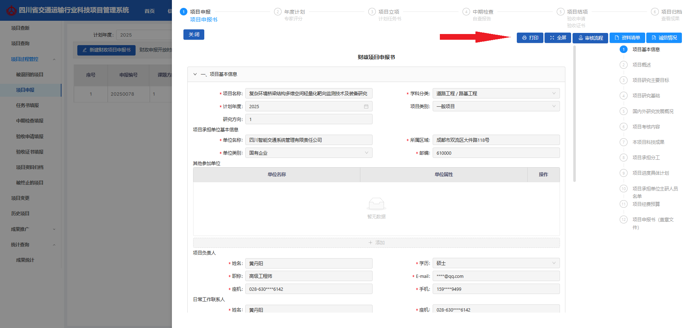
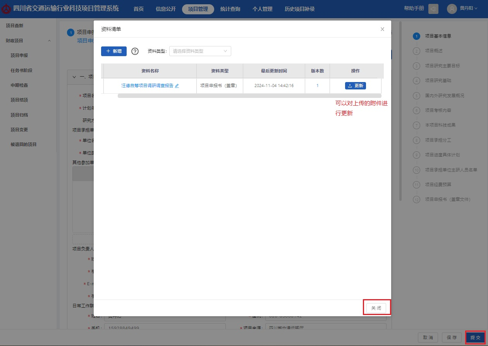

# 项目负责人操作指南V1.1(1)

**项目负责人操作指南**

### 系统登录

互联网访问地址：[https://182.150.21.199:4431/](https://182.150.21.199:4431/)

### 登录方式

1. 通过账号密码方式登录

.png>)

1. 通过手机短信方式登录

输入个人手机号，点&#x51FB;**“发送”**，输入收到的短信验证码，即可登录。

.png>)

### 更改密码

选择系统管理模块，再点击左&#x4FA7;**“密码修改”**&#x83DC;单，可设置个人新密码。

.png>)

### 首页

首页即为登录系统后所展示的页面，页面主要展示分为“待处理事务”、“公示公开”、“快捷入口”等模块。

.png>)

### 待处理事务

待处理事务显示当前用户待处理的事务信息，分为财政项目待办事项和自筹项目待办事项，可针对不同节点的待办事项点击快速跳转至对应节点处理。

.png>)

财政项目待办事项主要展示“将逾期未提交任务书的项目”、“将逾期未提交验收申请的项目”、“已超期未提交任务书的项目”、“已超期未提交验收申请的项目”、“被退回待修改”、“项目申报”、“计划任务书编制”、“中期检查”、“验收申请”、“验收证书”、“已终止”的待办。

自筹项目待办事项主要展示“将逾期未提交验收证书的项目”“已超期未提交验收证书的项目”“计划任务书编制、上传”“验收证书编制、上传”的待办。

### 公示公开及快捷入口

公示公开模块展示内部公开信息列表，如需查看信息详情则点击相关信息名称即可。

快捷入口提供“新建财政项目申报书”、“新建自筹项目申报书”、“项目工作台”、“系统信息”、“项目变更”等的快捷操作按钮，如需进行快捷操作点击相关按钮即可。

.png>)

### 信息公开

信息公开模块主要有公开公示、公文列表、系统消息模块，主要用于查看公示及系统信息和发布公文。

公示公开页展示内部公开信息，申报人登录系统后点击“信息公开”模块则可进入公示公开列表页面。

.png>)

申报人登陆点击“信息公开”菜单，再点击“公文列表”菜单，点击“收件箱”标签，进入收件箱页面。点击“发送公文”按钮，进入编辑页面。

.png>)

依次填写标题、公文内容，选择送达单位，上传附件，最后点击发送即可。

.png>)

系统消息页展示内部系统信息，申报人登录系统后点击“信息公开”模块，再点击“系统消息”则可进入系统消息页面查看系统消息。

.png>)

### 财政项目

### 项目查新

项目查重功能，输入项目名称、概述、技术关键、依托工程等关键宇可以搜索系统中是否存在相关或者类似项目，系统内项目名称不能重复。

.png>)

### 项目查询

以列表的形式展示项目信息，可以按照项目名称、项目类型、逾期超期、立项年度、完成年度、结题年度等条件进行筛选查询项目。

.png>)

### 项目申报

申报人进入系统首页后点击上方标题栏“财政项目”，然后点击项目过程管控，再点击“项目申报”按钮即可进入项目申报页，页面可新建“财政项目申报书”，也可编辑、查看、删除已保存的项目申报书等。

.png>)

#### 新建财政项目申报书 

申报人点击“新建财政项目申报书”按钮，进入申报指南页面，按照项目要求选择对应的课题，然后点击下一步。(**注意：选定研究方向后无法更改。**)

.png>)

进入项目申报书填报页面，标题信息一共分为十二项，点击标题信息可收缩或展开标题下方信息栏。右侧有快捷导航栏，点击对应标题信息可快速定位到相关信息栏。

.png>)

申报人依次将十二项信息栏填报完成，内容确认无误**先保存**。在提交之前需要在页面右侧的资料清单中上传项目申报书的盖章文件。

.png>)

**注意**：填报“项目研究主要目标”模块的时候，可以上传图片附件。

.jpeg>)

#### 打印项目申报书

申报人在“项目申报”列表点击项目名称，进入申报书查看页面

.png>)

点击打印图标，进入打印设置页面，设置好参数点击打印，完成打印操作。

#### 上传项目申报书

申报人点击资料清单按钮，然后点击新增，选择“项目申报书”，点击文件上传，附件上传后点击保存即可。

.jpeg>)

附件上传后会在资料清单中以列表的形式展示，并可以对附件进行更新。附件上传完成，关闭资料清单页面，点击提交进入内审、厅审环节。

创建的项目申报书会展示在项目申报列表中，点击项目名称可以查看申报书详情。

详情页面可以对申报书进行打印，查看审核流程、资料清单和诚信情况。

项目申报书审核完成后，进入专家评分、科信处编制年度计划环节，等计划下达后就会进入任务书阶段。

### 任务书填报

当项目制定项目计划并下达项目计划后，项目就会来的计划任务书页面。申报人登录系统后，点击上方“财政项目”，然后点击“项目过程管控”，再点击“任务书填报”即可进入项目任务书列表页面。

#### 上传任务书

申报人点击“编制”按钮即可进入编制任务书页面

计划任务书一共分为了14个信息栏，需要逐个填写完善，填写完成后点击保存。

#### 打印任务书

申报人在“任务书阶段”列表点击项目名称，进入任务书查看页面

点击打印图标，进入打印设置页面，设置好参数点击打印，完成打印操作。

#### 上传任务书

申报人在任务书列表页面，点击“编制”按钮进入编辑页面。

点击资料清单按钮，然后点击新增，选择“计划任务书”、“研究大纲”，点击文件上传，附件上传后点击保存即可。

附件上传后会在资料清单中以列表的形式展示，并可以对附件进行更新。附件上传完成，关闭资料清单页面，点击提交进入审批流程。

### 中期检查填报

任务书审核完成后接下来进入中期检查阶段。

申报人登录系统后点击上方“财政项目”按钮，然后点击“项目过程管控”，再点击“中期检查填报”标签即进入中期检查待办列表页。

申报人在列表中点击项目右侧的“查看”按钮，可查看当前项目已上传的中期检查列表。

申报人点击“新增中期检查”，上传附件，填写备注信息，确认无误点击提交即可。

中期检查提交审批后，进入单位内审和厅审环节。

### 验收申请填报

#### 编辑验收申请

申报人的中期检查报告全部审核通过的项目就会进入验收申请阶段。

申报人登录系统后点击“财政项目”按钮，然后点击“项目过程管控”，再点击“验收申请填报”标签即可进入验收申请待办窗口列表，列表中显示验收申请为已通过中期检查阶段的项目。

申报人找到对应的项目，点击项目右侧的“编制”按钮，进入编辑页面

编辑页面分为“基本信息”、“项目考核目标”、“技术经济指标”、“合同完成情况及预计产生的效益”、“提交验收的文档资料”、“成员名单”、“验收委员会名单”、“验收申请”八个模块，申报人依次按照顺序填写即可。

填写完验收申请后，点击保存，接下来打印验收申请。

#### 打印验收申请

申报人在“验收申请”列表点击项目名称，进入验收申请查看页面。

点击打印图标，进入打印设置页面，设置好参数点击打印，完成打印操作。

#### 上传验收申请

申报人在验收申请列表页面，点击“编制”按钮进入编辑页面。点击资料清单按钮，然后点击新增，选择“验收申请”，点击文件上传，附件上传后点击保存即可。

**注意**：专利、论文、经费测算报、研究总报告等成果资/结果资料都需要上传，未上传完成无法提交审批。

申报人上传完成对应的资料后，退出查看页面，再点击“编制”按钮进入编辑页面，验收申请内容、附件后认无误后点击提交即可。验收申请接下来会进入内审、厅审环节。

### 验收证书填报

申报人的项目验收申请被申报单位和科信处审核通过后则项目进入验收证书阶段。

申报人登录系统后点击“财政项目”按钮，再点击“验收证书填报”标签即可进入验收证书待办窗口列表，列表中显示的项目是进入验收证书阶段的项目。

#### 编辑验收证书

申报人在验收证书列表中找到对应的项目，点击右侧“编制”按钮即可进入编制验收证书窗口。

编辑页面分为“项目基本信息”、“项目的背景和必要性”、“项目研究主要目标、主要内容、技术关键、技术路线和应用方案”、“项目预期目标及经济社会效益”、“项目依托工程情况及其他必要支撑”、“项目的经济效益考核内容和考核指标”、“项目的社会效益考核内容和考核指标”、“课题成员名单”、“验收证书”九个模块，申报人依次按照顺序填写即可。

填写完验收证书内容后，点击保存，接下来打印验收申请。

#### 打印验收证书

申报人在“验收证书”列表点击项目名称，进入验收申请查看页面。

点击打印图标，进入打印设置页面，设置好参数点击打印，完成打印操作。

#### 上传验收证书

申报人在验收证书列表页面，点击“编制”按钮进入编辑页面。点击资料清单按钮，然后点击新增，选择“验收证书”，点击文件上传，附件上传后点击保存即可。

申报人上传完成对应的资料后，退出查看页面，再点击“编制”按钮进入编辑页面，验收证书内容、附件后认无误后点击提交即可。验收申请接下来会进入内审、厅审环节。

### 项目资料归档

申报人的验收证书被申报单位和科信处审核通过后则项目进入项目归档阶段。项目归档模块的功能为对项目的结果文件和指标项文件进行分类。

申报人登录系统后点击“财政项目”按钮，再点击“项目资料归档”标签即可进入项目归档待办窗口列表，列表中显示的项目是进入验收证书阶段的项目。

申报人在项目归档列表中找到对应的项目，点击右侧“编辑”按钮即可进入编制页面。申报人可以继续上传剩余的附件，并将附件进行分类。

左侧的功能区可以创建并维护文件夹，右侧的功能区则添加或者删除文件夹的附件。当所有的附件都归类完成后，点击提交按钮，进入内审和厅审环节。

### 被退回的项目

申报人提交的项目，包括申报阶段申报书、立项阶段计划任务书、中期检查提交的检查报告、结项阶段验收申请、验收证书、项目变更，在单位内审和厅科信处审核不通过时，项目会被退回到“被退回的项目”菜单。

申报人进入系统首页后点击上方标题栏“财政项目”菜单，再点击项目过程管控，选择“被退回的项目”标签，即可进入被退回的项目页面。

申报人可以对被退回的项目进行重新编辑，再次提交审核。

### 被终止的项目

被终止的项目分为“被终止的项目”、“不予受理的项目”、“不予立项的项目”三个模块。

申报人进入系统首页后点击上方标题栏“财政项目”菜单，再点击“被终止的项目”菜单，选择“被终止的项目”标签，即可进入被终止的项目页面。

#### 被终止的项目

科信处在任意阶段审核项目，选择终止选项，项目被终止退回到被终止的项目菜单。

申报人进入系统首页后点击上方标题栏“财政项目”菜单，再点击“被终止的项目”菜单，选择“被终止的项目”标签，即可进入被终止的项目页面

#### 不予受理的项目

申报审核厅审不予受理的项目，会归档到不予受理列表中。

#### 不予立项的项目

财政项目科信处审核通过后，编辑项目计划时，若该项目未进入项目计划，则项目计划下达后，项目被退回到不予立项的项目，未立项的项目不能再编辑提交。

申报人进入系统首页后点击上方标题栏“财政项目”菜单，再点击“项目过程管控”菜单，选择“不予立项的项目”标签，即可进入不予受理的项目列表页面。

### 项目变更

在项目中期检查阶段，若需要更改合同内容，申报人可发起项目变更，填写需要变更事项，由单位、科信处审核。

申报人登陆系统后点击“财政项目”菜单，再点击“项目变更”菜单，即可进入项目变更页面。

申报人点击新增，进入编辑页面。申报人选择变更项目，录入待变更项和变更说明，最后上传变更相应附件。内容填报完成点击提交，进入内审、厅审环节。

### 成果推广

申报人进入系统首页后点击上方标题栏“财政项目”菜单，再点击“成果推广”菜单，即可进入成果推广列表页面。

点击新增，选择对应的项目，再录入成果简介，点击提交即可。

### 统计查询

统计查询-成果统计，统计文档在最新阶段输入的“研究报告数量”、“专利数量”、“软件著作权数量”、“专著数量”、“论文数量”数量和上传附件查看。

### 历史项目

申报人登录系统后点击“财政项目”菜单，然后点击“历史项目”即可进入历史项目列表，用户可以通过“项目名称”、“项目状态”筛选条件进行筛选查询。

申报人点击“补录历史数据”，填报历史项目基础信息、预算、项目概述等信息，上传项目文件和主要成果，填报完成点击提交即可。

补录的项目默认完成了中期检查，申报人可以去“项目验收申请”菜单栏中找到补录项目，并发起项目验收申请。

### 自筹项目

### 项目查询

以列表的形式展示项目信息，可以按照项目名称、项目类型、逾期超期等条件进行筛选项目。

### 任务书填报

申报人登录系统后，点击上方“自筹项目”，然后点击“项目过程管控”，再点击“任务书填报”即可进入项目任务书列表页面。

申报人点击新增，进入任务书编制页面，依次填报任务书内容，先点击保存。

然后汇报编制页面，点击资料清单，上传相应的附件，如项目申报书、研究大纲等文件，最后提交审批即可，计划任务书阶段需上传**项目申报书的盖章文件**。

计划任务书厅审通过后需上传计划任务书的盖章文件

### 验收证书填报

申报人的项目任务书被申报单位和科信处审核通过后则项目进入验收证书阶段。

申报人登录系统后点击“财政项目”按钮，再点击“验收证书填报”标签即可进入验收证书待办窗口列表，列表中显示的项目是进入验收证书阶段的项目。

申报人找到对应的项目，点击项目右侧的“编制”按钮，进入编辑页面，依次填写验收证书内容，上传验收证书的盖章文件。

申报人点击资料清单，上传对应的指标项文件和结果文件，最后点击提交审批即可。

验收证书阶段厅审通过后需上传验收证书的盖章文件方可验收完成进行归档。

### 被终止的项目

科信处在任意阶段审核项目，选择终止选项，项目被终止退回到被终止的项目菜单。

项目申报人在项目未结题期间，可发起项目终止申请，单位及科信处审通过后，项目被终止退回到被终止项目菜单。

申报人进入系统首页后点击上方标题栏“自筹项目”菜单，再点击“被终止的项目”菜单，即可进入被终止的项目页面查看已终止的项目。

### 项目变更

在验收阶段之前，若需要更改项目内容，申报人可发起项目变更，填写需要变更事项，由单位、科信处审核。

申报人登陆系统后点击“自筹项目”菜单，再点击“项目变更”菜单，即可进入项目变更列表页面。

申报人点击“新增”按钮，进入填报页面，依次填写变更原因后上传变更的依据文件附件提交审批即可。

### 历史项目

申报人登录系统后点击“自筹项目”菜单，然后点击“历史项目”即可进入历史项目列表，用户可以通过“项目名称”、“项目状态”筛选条件进行筛选查询。

申报人点击“补录历史数据”，填报历史项目基础信息、预算、项目概述等信息，上传项目文件和主要成果，填报完成点击提交即可。

在研历史项目补录，填写项目基础信息，上传计划任务书阶段相关资料附件，由单位和科信处审核通过后，再到项目验收证书阶段。

已结题历史项目补录，填写项目基础信息后，需上传计划任务书阶段的相关资料及盖章文件，同时需上传验收证书阶段的相关资料及成果文件，由单位、科信处审核通过后到项目归档。

### 系统管理

用于维护申报人的个人信息，修改密码。
